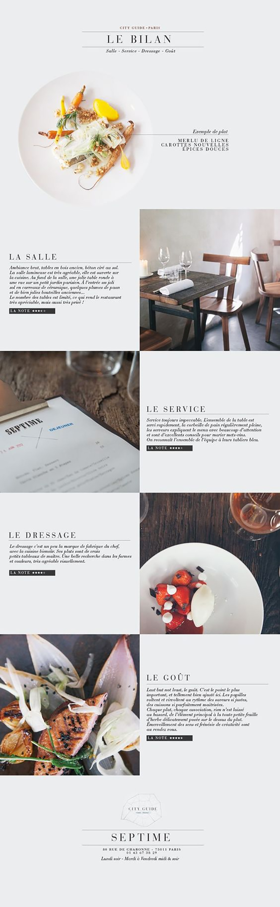

# Integration_CSS Orienté Objet
Intégration d'une maquette en *adaptive* et en CSS Orienté Objet

Le CSS Orienté Objet est une maniere d'aranger son style css afin de le rendre plus clair et efficace.

Pour en savoir plus, allez voir le trés bon guide [guide css](http://guidecss.fr/)

La mquette :

